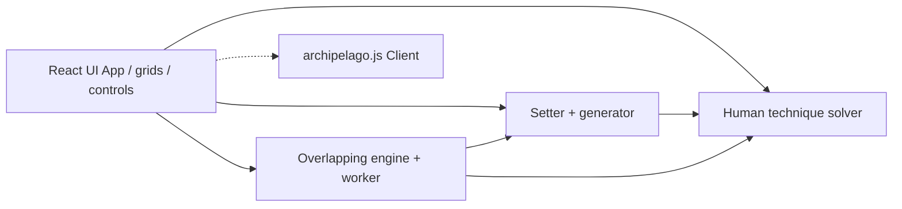

# System Architecture

Grounded in [00-description.md](00-description.md).

## Overview

Client-only React SPA. Puzzle domain logic lives under `src/sudoku/`; UI
components compose the setter/play experience in `src/`. A shared
`archipelago.js` `Client` is constructed at module scope as a readiness probe
until session wiring lands.

## Component breakdown

### Presentation (`src/`)

| Module | Role |
| --- | --- |
| `App.tsx` | Page shell, generation, mode, Archipelago badge |
| `SudokuGrid.tsx` / `SudokuCell.tsx` | Standard 9×9 play |
| `OverlappingSudokuBoard.tsx` | Overlap board orchestration |
| `UnifiedOverlappingGrid.tsx` | Single lattice rendering |
| `PuzzleViewport.tsx` / `PuzzleMinimap.tsx` | Pan/zoom + overview |
| `DifficultyPicker`, `OverlapControls`, `EntryModeControls` | Controls |
| `useEntryModeHotkeys.ts`, `longPressPan.ts`, `puzzleViewportMath.ts` | Interaction helpers |

### Domain (`src/sudoku/`)

| Area | Role |
| --- | --- |
| `grid.ts`, `generator.ts`, `types.ts` | Board model, random valid grids |
| `setter.ts` | Human-technique clue removal loop |
| `humanSolver.ts`, `solverState.ts`, `stepDetails.ts`, `solveStepLog.ts` | Technique apply + logging |
| `techniques/*` | Per-tier technique implementations + `TECHNIQUE_TIERS` |
| `pencilMarks.ts` | Pencil mark board model |
| `overlapping/*` | Topology, global board, constrained fill, worker, overlap setter/solver, unified layout |

## Design patterns

- **Technique registry:** difficulties expand to advanced-first technique lists
  via `getTechniquesForDifficulty`
- **Setter contract:** remove clue → full human solve must recover solution
- **Sparse global board:** overlapping cells keyed `"x,y"` in a `Map`
- **Worker offload:** `overlapFill.worker.ts` + `workerClient.ts` for heavy fill
- **Modular UI:** one reusable component per file (Cursor rule)

## Data flow

1. User selects mode/difficulty/(overlap params) → Generate
2. Standard: `createSudokuPuzzle` → `SudokuPuzzle` → local `Board` + pencil board
3. Overlapping: `createOverlappingSudokuPuzzle` (+ optional worker fill) →
   `OverlappingSudokuPuzzle` → `GlobalBoard`
4. Play updates boards through controlled components
5. Debug solve runs human techniques (and overlap-aware solve when overlapping)

## Integration points

- **archipelago.js:** `new Client()` in `App.tsx`; no server connection yet
- **GitHub Pages:** Vite `base` set from `GITHUB_PAGES` + repo name in CI
- **Web Workers:** overlapping constrained fill

## Architectural decisions (summary)

See [60-decisions.md](60-decisions.md) for the log. Key ones: human techniques
define difficulty; overlapping uses custom topology + unified lattice; SPA
static hosting only.

## Non-functional requirements

- Type-safe TypeScript throughout
- Unit test per source file; Playwright for user workflows
- Interactive generation UX (loading state, error message)
- Responsive controls; large boards navigable via viewport
