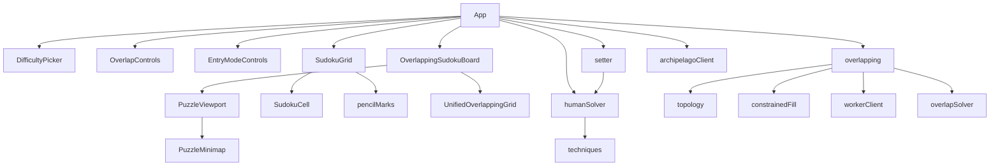

# Domain & Project Knowledge

Grounded in [00-description.md](00-description.md).

## Concepts

### Human-technique solve

Techniques mutate a `SolverState` (board + candidate masks). After any
placement or elimination, the solver restarts at the most advanced technique
available for the selected difficulty (advanced-first within each tier).

### Difficulty tiers

| Difficulty | Additional techniques (beyond easier tiers) |
| --- | --- |
| Easy | Cross-hatching, hidden singles, naked singles |
| Medium | Hidden/naked pairs & triples, locked candidates, pointing pairs/triples |
| Hard | Y-Wing, X-Wing |
| Expert | Swordfish |

Configured in `src/sudoku/techniques/index.ts` as `TECHNIQUE_TIERS`.

### Setter algorithm

1. Generate randomized valid solution
2. Shuffle all 81 cells; try removing each clue once
3. After removal, human solve must reach original solution
4. Failed removals restored and excluded from further attempts

Overlapping setter keeps shared boxes denser so uniqueness stays tractable.

### Overlapping topology

- Grids placed in global cell coordinates
- Edges share a rectangular block of `overlapBoxes` adjacent 3×3 boxes
- Board is sparse `Map` keyed `"x,y"`
- UI presents one unified lattice with viewport navigation

### Pencil marks

- Styles: standard vs corner/center
- Entry modes: digit vs pencil; Shift can flip corner/center while held
- Hotkeys via `useEntryModeHotkeys`

### Archipelago

- Multiworld randomizer network ([archipelago.gg](https://archipelago.gg/))
- JS client: [archipelago.js](https://archipelago.js.org/stable/)
- Current: `Client` constructed; no login/room yet

## Relationship map

## Resources

- README.md — scripts, status, technique table
- AGENTS.md — Cursor Cloud operational notes
- `.cursor/rules/modular-web-components.mdc`
- `.cursor/skills/memory-bank/` — Memory Bank skill, architecture, workflows
- Live site: https://leinb1dr.github.io/Sudokapelago/

## Best practices

- Add Vitest coverage for every new source file
- Add Playwright coverage for every new user-facing workflow
- Keep components modular (own file, single responsibility)
- Prefer extending `TECHNIQUE_TIERS` / technique modules over ad-hoc solvers
- Do not invent Archipelago protocol behavior without documenting a decision
- After significant work, run `mem:update` on Memory Bank files

## FAQ

**Q: Why isn’t Archipelago connected yet?**  
A: Client bootstrap proves dependency wiring; session/multiworld design is still
planned.

**Q: Can I change difficulty techniques?**  
A: Yes — reorder/replace `TECHNIQUE_TIERS` or pass a custom `techniques` array
to `solveWithHumanTechniques` / `createSudokuPuzzle`.

**Q: ESLint?**  
A: No — use oxlint.

**Q: Where do overlapping puzzles live?**  
A: Domain under `src/sudoku/overlapping/`; UI via `OverlappingSudokuBoard` and
friends.

## Implicit knowledge

- Cloud agents create branches `cursor/<name>-354e`, commit, push, and open PRs
  via ManagePullRequest (when operating in that environment)
- Detached HEAD / PR agent workflows may differ; prefer Memory Bank + AGENTS.md
  over assuming branch state
- Frontend design user rules apply for greenfield marketing UI; this app already
  has an established visual language — preserve it when editing existing pages
